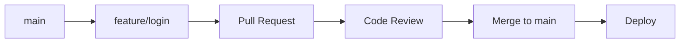
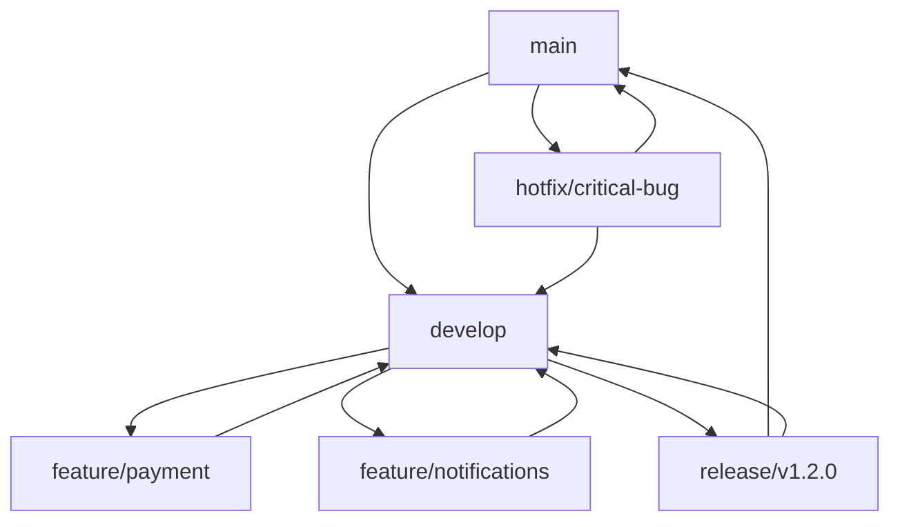
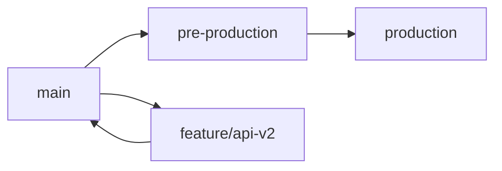

# 🌿 Git Workflows

[]()
[]()
[]()

> Guia completo de workflows Git para desenvolvimento colaborativo e preparação para entrevistas técnicas.

---

## 🎯 Por que Git Workflows são Fundamentais?

### 💼 **Importância Profissional**
- **Colaboração efetiva** - Trabalho em equipe organizado
- **Controle de versão** - Histórico limpo e rastreável
- **Deploy seguro** - Estratégias de release controladas
- **Padrão da indústria** - Usado em 99% das empresas

### 🚀 **Benefícios Técnicos**
- **Conflitos minimizados** - Merge conflicts reduzidos
- **Rollback fácil** - Reversão rápida de problemas
- **Code review** - Qualidade de código garantida
- **CI/CD integration** - Automação de deploy

---

## 🌊 Principais Git Workflows

### 🔸 **1. GitHub Flow (Simples e Efetivo)**

**Ideal para:** Projetos com deploy contínuo, equipes pequenas/médias



#### **Fluxo Prático:**

```bash
# 1. Criar e mudar para nova branch
git checkout -b feature/user-authentication
git push -u origin feature/user-authentication

# 2. Desenvolver funcionalidade
git add .
git commit -m "feat: implement user login endpoint"
git commit -m "test: add login integration tests"
git commit -m "docs: update API documentation"

# 3. Push e criar Pull Request
git push origin feature/user-authentication
# Criar PR via GitHub interface

# 4. Após aprovação, merge e cleanup
git checkout main
git pull origin main
git branch -d feature/user-authentication
git push origin --delete feature/user-authentication
```

#### **Vantagens:**
- ✅ Simples de entender e implementar
- ✅ Deploy contínuo facilitado
- ✅ Menos overhead de branches
- ✅ Ideal para equipes ágeis

#### **Desvantagens:**
- ❌ Menos controle sobre releases
- ❌ Pode ser caótico em equipes grandes
- ❌ Dificulta hotfixes complexos

---

### 🔸 **2. Git Flow (Estruturado e Robusto)**

**Ideal para:** Projetos com releases planejadas, equipes grandes



#### **Branches Principais:**

```bash
# main - código em produção
# develop - integração de features

# Branches de suporte:
# feature/* - novas funcionalidades
# release/* - preparação de releases
# hotfix/* - correções urgentes
```

#### **Fluxo Completo:**

```bash
# Inicializar Git Flow
git flow init

# Feature branch
git flow feature start user-profile
# Desenvolver...
git flow feature finish user-profile

# Release branch
git flow release start v1.2.0
# Ajustes finais, bump version...
git flow release finish v1.2.0

# Hotfix
git flow hotfix start critical-security-fix
# Corrigir bug...
git flow hotfix finish critical-security-fix
```

#### **Comandos Detalhados:**

```bash
# Feature Development
git checkout develop
git pull origin develop
git checkout -b feature/shopping-cart

# Desenvolvimento da feature
git add .
git commit -m "feat: add shopping cart functionality"
git commit -m "test: add cart unit tests"
git commit -m "refactor: optimize cart performance"

# Finalizar feature
git checkout develop
git pull origin develop
git merge --no-ff feature/shopping-cart
git push origin develop
git branch -d feature/shopping-cart

# Release Process
git checkout develop
git pull origin develop
git checkout -b release/v2.0.0

# Preparar release
echo "2.0.0" > VERSION
git add VERSION
git commit -m "bump: version 2.0.0"

# Finalizar release
git checkout main
git merge --no-ff release/v2.0.0
git tag -a v2.0.0 -m "Release version 2.0.0"
git checkout develop
git merge --no-ff release/v2.0.0
git branch -d release/v2.0.0
```

---

### 🔸 **3. GitLab Flow (Flexível e Prático)**

**Ideal para:** Projetos com múltiplos ambientes



#### **Environment Branches:**

```bash
# main - desenvolvimento
# pre-production - staging/testing
# production - produção

# Feature development
git checkout main
git pull origin main
git checkout -b feature/api-versioning

# Após desenvolvimento
git checkout main
git merge feature/api-versioning
git push origin main

# Deploy para staging
git checkout pre-production
git merge main
git push origin pre-production

# Deploy para produção (após testes)
git checkout production
git merge pre-production
git push origin production
```

---

## 🔧 Boas Práticas de Commit

### 🔸 **Conventional Commits**

```bash
# Formato: <type>[optional scope]: <description>

# Types principais:
feat: nova funcionalidade
fix: correção de bug
docs: documentação
style: formatação (não afeta lógica)
refactor: refatoração de código
test: adição/modificação de testes
chore: tarefas de manutenção

# Exemplos práticos:
git commit -m "feat(auth): implement JWT token validation"
git commit -m "fix(api): resolve null pointer in user service"
git commit -m "docs(readme): add installation instructions"
git commit -m "test(user): add integration tests for user creation"
git commit -m "refactor(payment): extract payment processor interface"
```

### 🔸 **Commit Message Template**

```bash
# Configurar template
git config commit.template ~/.gitmessage

# ~/.gitmessage
# <type>[optional scope]: <description>
#
# [optional body]
#
# [optional footer(s)]
#
# Types: feat, fix, docs, style, refactor, test, chore
# Scope: component/module affected
# Description: imperative mood, present tense
# Body: motivation for change and contrast with previous behavior
# Footer: breaking changes, issue references
```

---

## 🔄 Estratégias de Merge

### 🔸 **Merge vs Rebase vs Squash**

#### **Merge (Preserva Histórico)**
```bash
git checkout main
git merge feature/user-auth

# Resultado: merge commit preserva histórico da branch
```

#### **Rebase (Histórico Linear)**
```bash
git checkout feature/user-auth
git rebase main
git checkout main
git merge feature/user-auth

# Resultado: histórico linear, sem merge commits
```

#### **Squash (Commits Limpos)**
```bash
git checkout main
git merge --squash feature/user-auth
git commit -m "feat: implement user authentication system"

# Resultado: múltiplos commits viram um só
```

### 🔸 **Interactive Rebase**

```bash
# Limpar últimos 3 commits
git rebase -i HEAD~3

# Editor abre com opções:
pick abc1234 feat: add login endpoint
squash def5678 fix: handle edge case
reword ghi9012 test: add login tests

# Comandos disponíveis:
# pick - usar commit como está
# reword - editar mensagem
# edit - parar para editar
# squash - combinar com commit anterior
# drop - remover commit
```

---

## 🚀 Automação e Hooks

### 🔸 **Pre-commit Hooks**

```bash
#!/bin/sh
# .git/hooks/pre-commit

# Executar testes
npm test
if [ $? -ne 0 ]; then
    echo "Tests failed. Commit aborted."
    exit 1
fi

# Verificar linting
npm run lint
if [ $? -ne 0 ]; then
    echo "Linting failed. Commit aborted."
    exit 1
fi

# Verificar formatação
npm run format:check
if [ $? -ne 0 ]; then
    echo "Code formatting issues found. Run 'npm run format' and try again."
    exit 1
fi
```

### 🔸 **Husky Configuration**

```json
// package.json
{
  "husky": {
    "hooks": {
      "pre-commit": "lint-staged",
      "commit-msg": "commitlint -E HUSKY_GIT_PARAMS",
      "pre-push": "npm test"
    }
  },
  "lint-staged": {
    "*.{js,ts}": ["eslint --fix", "prettier --write"],
    "*.{json,md}": ["prettier --write"]
  }
}
```

---

## 🎯 Resolução de Conflitos

### 🔸 **Merge Conflicts**

```bash
# Quando conflito ocorre
git merge feature/payment
# Auto-merging src/payment.js
# CONFLICT (content): Merge conflict in src/payment.js

# Arquivo com conflito:
<<<<<<< HEAD
function processPayment(amount) {
    return validateAmount(amount);
}
=======
function processPayment(amount, currency) {
    return validatePayment(amount, currency);
}
>>>>>>> feature/payment

# Resolver manualmente e finalizar
git add src/payment.js
git commit -m "resolve: merge conflict in payment processing"
```

### 🔸 **Ferramentas de Merge**

```bash
# Configurar merge tool
git config merge.tool vimdiff
git config merge.tool vscode

# Usar merge tool
git mergetool

# Configurar VS Code como merge tool
git config merge.tool vscode
git config mergetool.vscode.cmd 'code --wait $MERGED'
```

---

## 🎯 Preparação para Entrevistas

### ✅ **Perguntas Frequentes**

#### **Workflows**
**P:** "Qual workflow Git você usaria para um projeto com releases mensais?"
**R:** "Git Flow seria ideal porque oferece branches dedicadas para releases, permitindo desenvolvimento paralelo de features enquanto prepara a release. Hotfixes podem ser aplicados diretamente na main e backported para develop."

#### **Estratégias de Merge**
**P:** "Quando usar rebase vs merge?"
**R:**
- **Rebase:** Para manter histórico linear, features pequenas, branches pessoais
- **Merge:** Para preservar contexto, features colaborativas, branches públicas

#### **Resolução de Conflitos**
**P:** "Como você resolveria um conflito complexo?"
**R:**
1. Analisar origem do conflito
2. Comunicar com autor da outra branch
3. Usar merge tool se necessário
4. Testar após resolução
5. Commit com mensagem descritiva

---

## 📈 Roadmap de Aprendizado

### 🥇 **Nível Iniciante (1-2 semanas)**
1. Git básico (add, commit, push, pull)
2. Branching e merging simples
3. GitHub Flow básico
4. Resolução de conflitos simples

### 🥈 **Nível Intermediário (2-4 semanas)**
1. Git Flow completo
2. Rebase interativo
3. Hooks e automação
4. Conventional commits

### 🥉 **Nível Avançado (1-2 meses)**
1. Workflows customizados
2. Git internals
3. Performance optimization
4. Team leadership em Git

---

## 🎓 Conclusão

Git Workflows são **essenciais** porque:

- ✅ **Colaboração efetiva** - Trabalho em equipe organizado
- ✅ **Qualidade de código** - Code review sistemático
- ✅ **Deploy seguro** - Controle de releases
- ✅ **Produtividade** - Processos automatizados
- ✅ **Padrão profissional** - Esperado em todas as empresas

**Lembre-se:** O melhor workflow é aquele que a equipe consegue seguir consistentemente! 🎯

---

*Desenvolvido para preparação em entrevistas técnicas e crescimento profissional em Git Workflows.*
