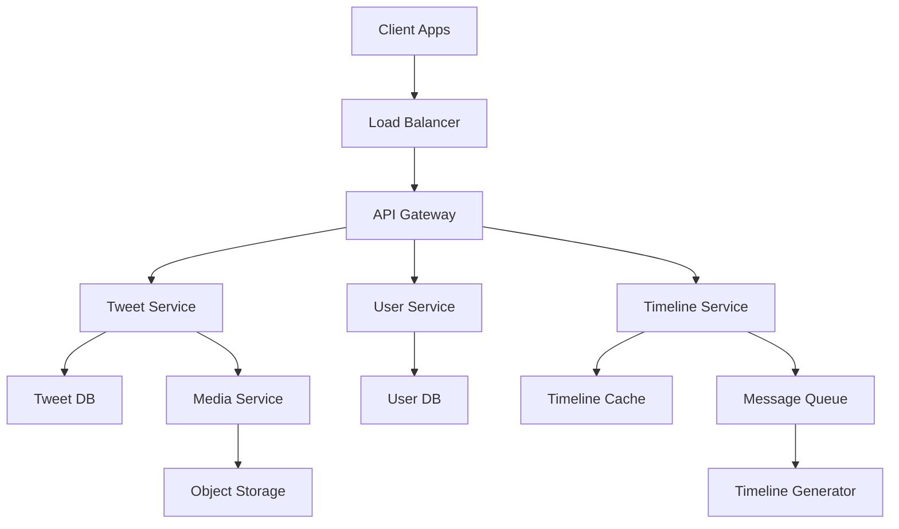
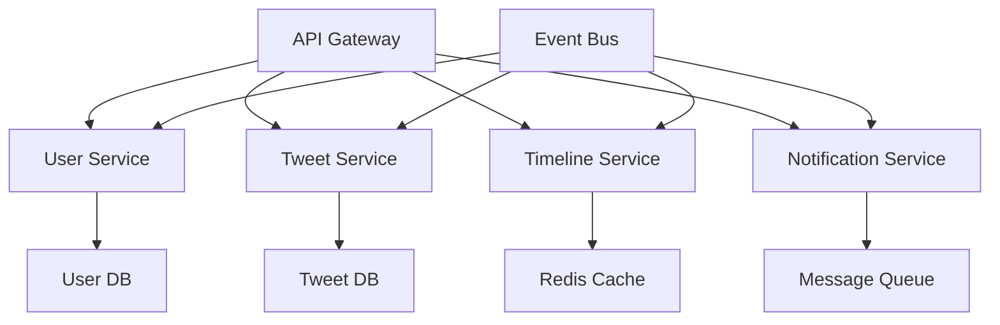

# 🏗️ System Design

[]()
[]()
[]()

> Guia completo de System Design para entrevistas técnicas e arquitetura de sistemas escaláveis.

---

## 🎯 Por que System Design é Fundamental?

### 💼 **Importância Profissional**
- **Entrevistas sênior** - Obrigatório para vagas pleno/sênior
- **Arquitetura de software** - Base para decisões técnicas
- **Escalabilidade** - Sistemas que crescem com o negócio
- **Liderança técnica** - Visão macro de sistemas

### 🚀 **Benefícios Técnicos**
- **Pensamento sistêmico** - Visão holística de arquitetura
- **Trade-offs** - Balanceamento de requisitos
- **Performance** - Otimização em escala
- **Confiabilidade** - Sistemas robustos e resilientes

---

## 📋 Framework para System Design

### 🔸 **1. Clarificar Requisitos (5-10 min)**

#### **Requisitos Funcionais**
```
Exemplo: Design do Twitter

Perguntas essenciais:
- Quais funcionalidades principais? (tweet, follow, timeline)
- Quantos usuários? (300M ativos)
- Quantos tweets por dia? (150M tweets)
- Tamanho médio do tweet? (280 chars)
- Mídia suportada? (fotos, vídeos)
- Busca necessária? (sim, em tempo real)
```

#### **Requisitos Não-Funcionais**
```
- Disponibilidade: 99.9% (8.76h downtime/ano)
- Latência: < 200ms para timeline
- Consistência: Eventual consistency OK
- Escalabilidade: 10x crescimento em 5 anos
- Durabilidade: Tweets não podem ser perdidos
```

### 🔸 **2. Estimativas de Capacidade (5-10 min)**

```
Exemplo: Twitter Scale

Usuários:
- 300M usuários ativos mensais
- 150M usuários ativos diários
- Pico: 2x tráfego médio

Tweets:
- 150M tweets/dia = 1,736 tweets/segundo
- Pico: 3,500 tweets/segundo
- Read:Write ratio = 100:1

Storage:
- Tweet: 280 chars = 280 bytes
- Metadata: ~200 bytes
- Total por tweet: ~500 bytes
- 150M tweets/dia * 500 bytes = 75GB/dia
- 5 anos: 75GB * 365 * 5 = ~137TB

Bandwidth:
- Write: 3,500 tweets/s * 500 bytes = 1.75MB/s
- Read: 3,500 * 100 = 350K requests/s
- Timeline: 350K * 10 tweets * 500 bytes = 1.75GB/s
```

### 🔸 **3. Design de Alto Nível (10-15 min)**



### 🔸 **4. Design Detalhado (15-20 min)**

#### **Database Schema**
```sql
-- Users Table
CREATE TABLE users (
    user_id BIGINT PRIMARY KEY,
    username VARCHAR(50) UNIQUE,
    email VARCHAR(100) UNIQUE,
    created_at TIMESTAMP,
    follower_count INT DEFAULT 0,
    following_count INT DEFAULT 0
);

-- Tweets Table
CREATE TABLE tweets (
    tweet_id BIGINT PRIMARY KEY,
    user_id BIGINT,
    content TEXT,
    created_at TIMESTAMP,
    like_count INT DEFAULT 0,
    retweet_count INT DEFAULT 0,
    INDEX idx_user_created (user_id, created_at)
);

-- Follows Table
CREATE TABLE follows (
    follower_id BIGINT,
    following_id BIGINT,
    created_at TIMESTAMP,
    PRIMARY KEY (follower_id, following_id)
);
```

#### **API Design**
```java
// Tweet Service API
@RestController
public class TweetController {
    
    @PostMapping("/tweets")
    public ResponseEntity<Tweet> createTweet(@RequestBody CreateTweetRequest request) {
        // 1. Validate content
        // 2. Save tweet
        // 3. Trigger timeline update
        // 4. Return tweet
    }
    
    @GetMapping("/users/{userId}/timeline")
    public ResponseEntity<List<Tweet>> getTimeline(
            @PathVariable Long userId,
            @RequestParam(defaultValue = "20") int limit,
            @RequestParam(required = false) String cursor) {
        // 1. Get from cache if available
        // 2. Generate timeline if not cached
        // 3. Return paginated results
    }
}
```

### 🔸 **5. Escalabilidade e Otimizações (10-15 min)**

#### **Caching Strategy**
```java
// Timeline Caching
@Service
public class TimelineService {
    
    @Autowired
    private RedisTemplate<String, Object> redisTemplate;
    
    public List<Tweet> getTimeline(Long userId) {
        String cacheKey = "timeline:" + userId;
        
        // Try cache first
        List<Tweet> timeline = (List<Tweet>) redisTemplate.opsForValue().get(cacheKey);
        
        if (timeline == null) {
            // Generate timeline
            timeline = generateTimeline(userId);
            
            // Cache for 1 hour
            redisTemplate.opsForValue().set(cacheKey, timeline, Duration.ofHours(1));
        }
        
        return timeline;
    }
    
    private List<Tweet> generateTimeline(Long userId) {
        // 1. Get user's following list
        // 2. Fetch recent tweets from followed users
        // 3. Sort by timestamp
        // 4. Return top N tweets
    }
}
```

#### **Database Sharding**
```java
// Tweet Sharding Strategy
@Component
public class TweetShardingStrategy {
    
    private static final int SHARD_COUNT = 16;
    
    public String getShardKey(Long tweetId) {
        return "shard_" + (tweetId % SHARD_COUNT);
    }
    
    public String getShardKey(Long userId, LocalDateTime timestamp) {
        // Shard by user_id for better locality
        return "shard_" + (userId % SHARD_COUNT);
    }
}
```

---

## 🏗️ Padrões de Arquitetura

### 🔸 **Microservices Architecture**



#### **Service Communication**
```java
// Event-Driven Communication
@EventListener
public class TimelineEventHandler {
    
    @Autowired
    private TimelineService timelineService;
    
    @Async
    public void handleTweetCreated(TweetCreatedEvent event) {
        // Update timelines of all followers
        List<Long> followers = userService.getFollowers(event.getUserId());
        
        for (Long followerId : followers) {
            timelineService.addTweetToTimeline(followerId, event.getTweet());
        }
    }
}
```

### 🔸 **CQRS (Command Query Responsibility Segregation)**

```java
// Command Side - Write Operations
@Service
public class TweetCommandService {
    
    @Autowired
    private TweetRepository tweetRepository;
    
    @Autowired
    private EventPublisher eventPublisher;
    
    public Tweet createTweet(CreateTweetCommand command) {
        Tweet tweet = new Tweet(command.getUserId(), command.getContent());
        tweet = tweetRepository.save(tweet);
        
        // Publish event for read side
        eventPublisher.publish(new TweetCreatedEvent(tweet));
        
        return tweet;
    }
}

// Query Side - Read Operations
@Service
public class TweetQueryService {
    
    @Autowired
    private TweetReadRepository readRepository;
    
    public List<Tweet> getTimeline(Long userId, int limit) {
        // Optimized read model
        return readRepository.getTimelineForUser(userId, limit);
    }
}
```

---

## 📊 Casos de Estudo Clássicos

### 🔸 **1. Design de URL Shortener (bit.ly)**

#### **Requisitos:**
- 100M URLs por dia
- 100:1 read/write ratio
- URLs devem ser únicos
- Analytics básicas

#### **Solução:**
```java
// Base62 Encoding
public class UrlShortener {
    
    private static final String BASE62 = "abcdefghijklmnopqrstuvwxyzABCDEFGHIJKLMNOPQRSTUVWXYZ0123456789";
    
    public String encode(long id) {
        StringBuilder sb = new StringBuilder();
        while (id > 0) {
            sb.append(BASE62.charAt((int)(id % 62)));
            id /= 62;
        }
        return sb.reverse().toString();
    }
    
    public long decode(String shortUrl) {
        long result = 0;
        for (char c : shortUrl.toCharArray()) {
            result = result * 62 + BASE62.indexOf(c);
        }
        return result;
    }
}
```

### 🔸 **2. Design de Chat System (WhatsApp)**

#### **Arquitetura WebSocket:**
```java
@Component
public class ChatWebSocketHandler extends TextWebSocketHandler {
    
    private final Map<String, WebSocketSession> sessions = new ConcurrentHashMap<>();
    
    @Override
    public void afterConnectionEstablished(WebSocketSession session) {
        String userId = getUserId(session);
        sessions.put(userId, session);
        
        // Notify user is online
        presenceService.setUserOnline(userId);
    }
    
    @Override
    protected void handleTextMessage(WebSocketSession session, TextMessage message) {
        ChatMessage chatMessage = parseMessage(message.getPayload());
        
        // Save message
        messageService.saveMessage(chatMessage);
        
        // Forward to recipient
        WebSocketSession recipientSession = sessions.get(chatMessage.getRecipientId());
        if (recipientSession != null && recipientSession.isOpen()) {
            recipientSession.sendMessage(message);
        } else {
            // Store for offline delivery
            offlineMessageService.store(chatMessage);
        }
    }
}
```

---

## 🎯 Preparação para Entrevistas

### ✅ **Template de Resposta**

#### **1. Clarificação (5 min)**
```
"Antes de começar o design, gostaria de esclarecer alguns requisitos:

Funcionais:
- Quais são as principais funcionalidades?
- Quantos usuários esperamos?
- Qual o volume de dados?

Não-funcionais:
- Qual a disponibilidade esperada?
- Latência aceitável?
- Consistência vs disponibilidade?"
```

#### **2. Estimativas (5 min)**
```
"Vamos fazer algumas estimativas de back-of-the-envelope:

Usuários: X milhões
Requests/segundo: Y
Storage: Z TB
Bandwidth: W GB/s"
```

#### **3. High-level Design (10 min)**
```
"Aqui está o design de alto nível:
[Desenhar diagrama simples]

Componentes principais:
- Load Balancer
- API Gateway
- Microservices
- Databases
- Cache"
```

#### **4. Deep Dive (15 min)**
```
"Vamos detalhar os componentes críticos:

Database schema:
[Mostrar tabelas principais]

API design:
[Endpoints principais]

Algoritmos:
[Lógica de negócio]"
```

#### **5. Scale (10 min)**
```
"Para escalar o sistema:

- Database sharding
- Caching strategies
- CDN para static content
- Load balancing
- Monitoring e alerting"
```

### ✅ **Perguntas Frequentes**

#### **Trade-offs**
**P:** "SQL vs NoSQL para este sistema?"
**R:** 
- **SQL:** ACID, relacionamentos complexos, queries ad-hoc
- **NoSQL:** Escalabilidade horizontal, schema flexível, performance

#### **Consistency**
**P:** "Como garantir consistência em sistema distribuído?"
**R:**
- **Strong consistency:** Transações distribuídas (2PC)
- **Eventual consistency:** Event sourcing, CQRS
- **Escolha:** Depende dos requisitos de negócio

---

## 📈 Roadmap de Aprendizado

### 🥇 **Nível Iniciante (1-2 meses)**
1. Fundamentos de arquitetura
2. Database design
3. Caching strategies
4. Load balancing básico

### 🥈 **Nível Intermediário (2-4 meses)**
1. Microservices patterns
2. Distributed systems concepts
3. CAP theorem na prática
4. Message queues

### 🥉 **Nível Avançado (4+ meses)**
1. System design interviews
2. Large-scale architectures
3. Performance optimization
4. Disaster recovery

---

## 🎓 Conclusão

System Design é **fundamental** porque:

- ✅ **Entrevistas técnicas** - Obrigatório para vagas sênior
- ✅ **Arquitetura de software** - Base para decisões técnicas
- ✅ **Escalabilidade** - Sistemas que crescem
- ✅ **Liderança técnica** - Visão estratégica
- ✅ **Resolução de problemas** - Pensamento sistêmico

**Lembre-se:** Não existe design perfeito, apenas trade-offs bem justificados! ⚖️

---

*Desenvolvido para preparação em entrevistas técnicas e crescimento profissional em System Design.*
